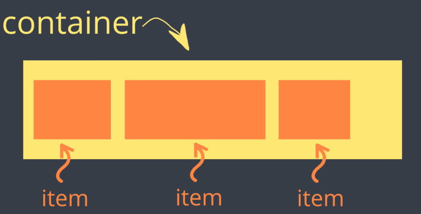
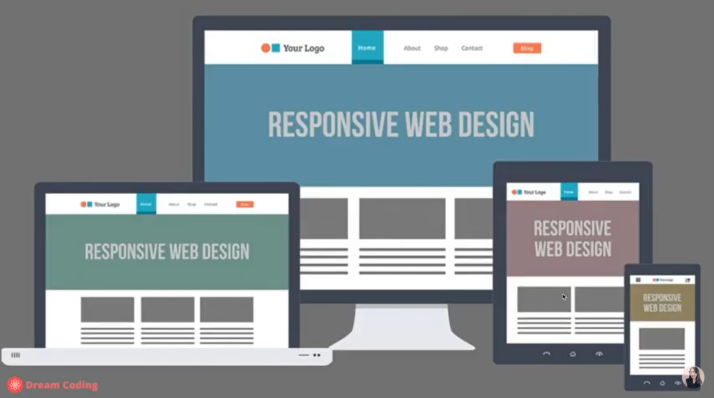

### 1. Project name: Learning CSS functions

- CSS: Cascading Style Sheet
- This helps to find the suitable styling according to the sequence below.
  Sequence: Author style → User style → Browser
- Good labeling makes it easier to choose the style.
- The most important thing for web page creation is to place defined boxs in desired location and disred size.

### 2. Period: 2 days

### 3. Architecture diagram

### 4. Selector

- Format: `Selector { property: value; }`
- Priority of application: The selector applied near the tags.
  ex) `li {}` > `* {}`
  `li {}` > `#id {}`

#### 4-1. Classified Selectors

- Universal `*`: Universal selector is defined to apply to all tags.
- Type `Tag`: Tag selector is defined to apply to the tags named "`<name>`".

  ex) `div, span {}`: Select tags named "div" and "span". In case of `div {}` takes priority than `div, span {}`.

- ID `#id`: ID selector is defined to apply to the tags with ID.
- Class `.class`: Class selector is defined to apply to tags with class.
- State `:` State selector is defined to apply to pseudo-class and pseudo-element.

  ex) `button:hover {}`: Only select when it is being hovered over by mouse pointer.

- Attribute `[]`: Attribute selector is defined to apply to tags with attribute.

  ex) `a[href] {}`: Only select anchor tags with attributed href. In case of attribute with "naver.com", use `a[href="naver.com]`. In case of attribute that starts with "naver", use `a[href^="naver"]`. In case of attribute that end with ".com", use `a[href$=".com]`.

### 5. Styling

#### 5-1. Color styling

- `color`: Font color
- `backgroud`: Background color

#### 5-2. Area styling

- `width`: Width of specified area.
- `height`: Height of specified area. In case of 100vh(viewport height), regardless of its parent, container display on according to screen size when viewport is applied. In case of 100%, container display on if 100% is applied on all its parents.
- If you specify the one of width or height without creating content, not display on screen. Please specify width and height for display on screen correctly.
- `padding`: Set padding area on all four sides of the element. Padding area means the area near content. If you want extra area in direction, use `padding-top`, `padding-bottom`, `padding-right`, `padding-left`.
- `margin`: Set margin area on all four sides of the element. Margin area means outermost area. If you want extra area in direction, use `margin-top`, `margin-bottom`, `margin-right`, `margin-left`.
- In case of background color, If padding value is expressed, background color area is larger than before. If margin value is expressed, it seems to creat extra space out of content on all four sides as much as px value.
- `border`: Set border area on all four sides of the element. You can set width, style, color about border. If not choice of color, comply with universal color. Default color is black. Use `border-width`, `border-style`, `border-color` respectively. In addition, You can use syntax like `border: <width> <style> <color>`.

#### 5-3. Block or Inline

- `display`: Set whether and element is treatd as block or inline element and the layout used for its children, such as flow layout, grid, flex.
- If you use `display: flex` with other commans below, it is easier to set elements positioning in screen.
  `flex-direction`,`flex-wrap`, `flex-flow`, `justify-content`(main axis), `align-content`(cross axis), `align-items` in container.
  If you want to adjust scale to fit screen, use `flex-grow`, `flex-shrink`, `flex-basis` in item respectively.
- `position`: Set how an element is positioned in screen. If you only use `top`, `bottom`, `left`, `right` without `position`, won't be applied to, because default position is static. Please use `top`, `bottom`, `left`, `right` with `position`.

### 6. Media query(Responsive Web Design)

- `@media screen and (min-width: 600px){.container{width: 50%; color: blue;}}`: Responsive web design is applied to screen according to container size. If width is over 600px, use 50% width. You could set priority you need to appeal to information while adjusting container size.

### 7. Resolution of failures

- symptom: `error: failed to push some refs to 'https://github.com/Matthew530419/Tutorial.git'` when `git push`
  I think fast foward conditions don't meet preconditions.

  `CONFLICT (content): Merge conflict in HTML/README_HTML.md` when `git pull`

  I think same file was used on b4b56e8 and 3f02ac7. There are changers both of them, and then, conflict came from confused computer about which one to choose.

  countermeasure: use `git mergetool` for fix conflict and `git merge --continue` when finished to fix. Fast forward conditions meet preconditions because pointer of origin/main branch is same as moved to up-to-date commit.

  
  
